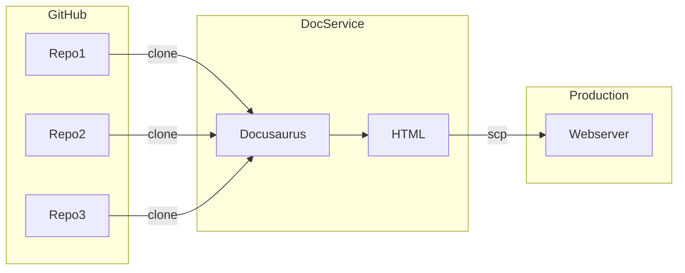

# DocsGen

DocsGen is the tool used to build the EOS documentation. It consists of a set of scripts and configuration files to generate the EOS Web Documentation Portal. The goal of this project is to create a single web portal linking together documentation across the EOS Network code repositories. This portal will make an effort to make it easy to build and maintain EOS projects, according to the following objectives:
* Single place EOS documentation
* Unified presentation of documentation
* Single navigation hierarchy covering documentation
* Consistent UI for documentation

## System Design

In a nutshell, a shell script clones a git repository, and puts the content into a staging server. The staging server builds the content into the documentation you see on the website. The current system uses [Docusaurus](https://docusaurus.io/) to convert markdown into HTML, power navigation, and manage versions.

Testing utilizes [Cypress](https://www.cypress.io/), while search is powered by [algolia](https://www.algolia.com/).

## Coverage

|   Topic  |  Source Repository  | Top Level Path | Process To HTML |
|  ------- | ------------------- | -------------- | ------------ |
| Nodeos HTTP API | [mandel](https://github.com/AntelopeIO/leap) | leap-plugins/ | openAPI yaml and redocly |
| JS SDK API Documentation | [mandel-eosjs](https://github.com/eosnetworkfoundation/mandel-eosjs) | eosjs/ | Docusaurus |
| Swift API Documentation | [mandel-swift](https://github.com/eosnetworkfoundation/mandel-swift) | reference/swiftdocs | static html |
| Swift API Manuals | [mandel-swift](https://github.com/eosnetworkfoundation/mandel-swift) | swift-sdk | Docusaurus |
| Java API Documentation | [mandel-java](https://github.com/eosnetworkfoundation/mandel-java) | reference/javadocs | static html |
| EOS System Contracts | [eos-system-contracts](https://github.com/eosnetworkfoundation/eos-system-contracts) | system-contracts | Docusaurus |
| Contract Developer Tools | [cdt](https://github.com/AntelopeIO/cdt) | cdt | Docusarus |
| DUNE | [DUNE](https://github.com/AntelopeIO/DUNE.git) | DUNE | Docusarus |
| Nodeos, Cleos, Kloes Manuals | [Leap](https://github.com/AntelopeIO/leap) | leap | Docusarus |
| Tutorials | [Docs](https://github.com/eosnetworkfoundation/docs.git) | docs/tutorials | Docusarus |
| Glossary | [Docs](https://github.com/eosnetworkfoundation/docs.git) | glossary | Docusarus |
| Docs | [Docs](https://github.com/eosnetworkfoundation/docs.git) | docs | docusarus |

## Documentation
For information on how to generate content, update the site navigation, update the UX presentation, production setup, and testing, visit the [documentation](docs/index.md) section.
