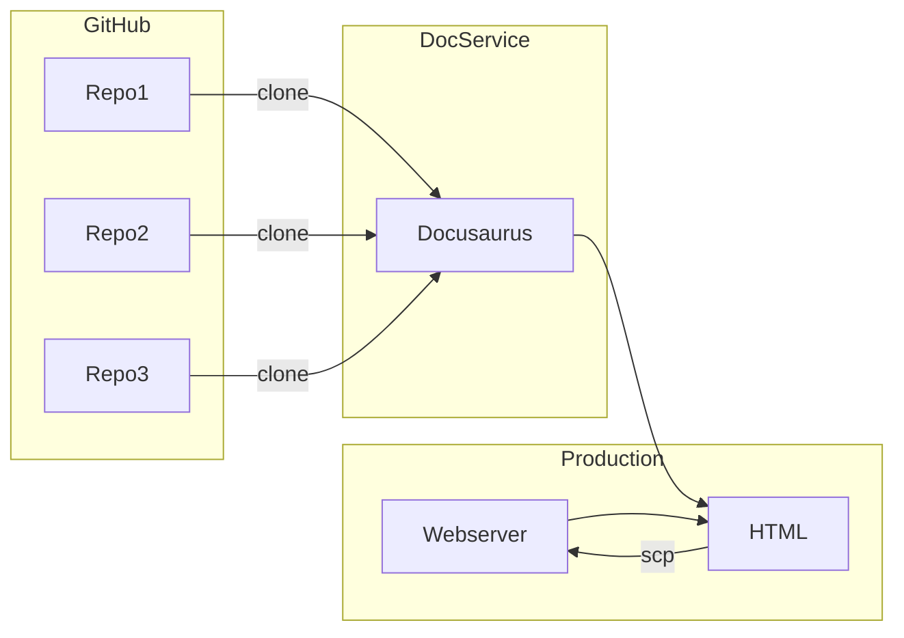

# Automated Documentation #
Scripts to generate Web Documentation Portal. Goal of this project is create a single documentation portal linking together documentation across the EOS Network's code repositories. This portal will make an effort to make it easy to build and maintain EOS projects.
* Single place EOS documentation
* Unified presentation of documentation
* Single navigation hierarchy covering documentation
* Consistent UI for documentation

## System Design

The system was keep simple. A shell script clones a git repository, and puts the content into a staging server. The staging server builds the content into the documentation you see on the website. The current system uses Docusaurus to convert markdown into HTML, power navigation, and manage versions.



In addition, tools are included to help maintain documentation in source repositories. An example is broken link crawlers, looking for bad links in .md files.

## Organization ##
* devdocs - root for Docusaurus project
   * welcome - the welcome repo
   * eos cdt - developer tools
   * eos contracts - system contracts
   * leap - core blockchain code
* reference - auto generated documentation from code that is not compatible with Docusaurus
   * mandel-contracts
   * mandel-cdt
   * ...
   * swiftdocs


### `Coverage` ###

|   Topic  |  Source Repository  | Top Level Path | Process To HTML |
|  ------- | ------------------- | -------------- | ------------ |
| Nodeos HTTP API | [mandel](https://github.com/AntelopeIO/leap) | reference/mandel-plugins | static html with redocly |
| JS and Node Documentation | [mandel-eosjs](https://github.com/eosnetworkfoundation/mandel-eosjs) | eosdocs/client-side/jsdocs | Docusaurus |
| Swift Documentation | [mandel-swift](https://github.com/eosnetworkfoundation/mandel-swift) | reference/swiftdocs | static html |
| Java Documenation | [mandel-java](https://github.com/eosnetworkfoundation/mandel-java) | reference/javadocs | static html |
| EOS System Contracts | [eos-system-contracts](https://github.com/eosnetworkfoundation/eos-system-contracts) | reference/mandel-contracts | static html |
| Contract Developer Tools | [cdt](https://github.com/AntelopeIO/cdt) | eosdocs/cdt | docusarus |
| DUNE | [DUNE](https://github.com/AntelopeIO/DUNE.git) | eosdocs/dune | docusarus |
| Nodeos | [Mandel](https://github.com/AntelopeIO/leap) | eosdocs/leap/01_nodeos | docusarus |
| Cleos | [Mandel](https://github.com/AntelopeIO/leap) | eosdocs/developer-tools/02_cleos | docusarus |
| Leap Install | [Mandel](https://github.com/AntelopeIO/leap) | eosdocs/developer-tools/00_install | docusarus |
| Tutorial | [Mandel](https://github.com/eosnetworkfoundation/welcome.git) | eosdocs/tutorials | docusarus |
| Glossary | [Welcome](https://github.com/eosnetworkfoundation/welcome.git) | eosdocs/glossary | docusarus |
| Welcome | [Welcome](https://github.com/eosnetworkfoundation/welcome.git) | welcome | docusarus |

## Initialize Content Repository ##
See [First Install Software](docs/FirstInstallSoftware.md) for all the dependancies.

## Generating Content ##
The script `generate_documents.sh` clones various git repos, extracts documentation and then copies to `/path/to/build_dir folder`. The scripts are designed to be called once for each git repository.
```
Creates web version of documentation pulling together documentation from several gitrepositories across the EOS Networks

Syntax: generate_documents.sh [-r|d|b|t|v|i|h]
mandatory: -r owner/rep and -d directory

options:
-r: owner/repository name of the git repository and source for documentation
-d: specify directory for building the static HTML documentation
-b: branch to use for git
-t: tag to use for git
-i: private key for web host, needed to install files
-h: destination host(s) where to install files
-f: fast, skip git clone if files less then 1 hour old

example: generate_documents.sh -r eosnetworkfoundation/mandel -b ericpassmore-working -t v3.1.1 -d /path/to/build_root -i aws_identity -h hostA -h hostB
Run script to build mandel docs and update production site , with branch ericpassmore-working and tag v3.1.1. This updates latest documentation version
```

After running there will be many static HTML, CSS, JS files under `/path/to/build_dir/devdocs/build`. The files are served as the current production version.

See [Generating Documents](docs/GeneratingDocuments.md) for additional details
