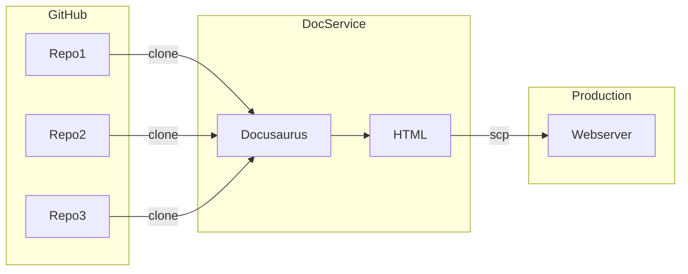

# Automated Documentation #
Scripts to generate Web Documentation Portal. Goal of this project is create a single documentation portal linking together documentation across the EOS Network's code repositories. This portal will make an effort to make it easy to build and maintain EOS projects.
* Single place EOS documentation
* Unified presentation of documentation
* Single navigation hierarchy covering documentation
* Consistent UI for documentation

## System Design

A shell script clones a git repository, and puts the content into a staging server. The staging server builds the content into the documentation you see on the website. The current system uses [Docusaurus](https://docusaurus.io/) to convert markdown into HTML, power navigation, and manage versions.



Testing utilizes [Cypress](https://www.cypress.io/), while search is powered by [algolia](https://www.algolia.com/).

## Coverage ##

|   Topic  |  Source Repository  | Top Level Path | Process To HTML |
|  ------- | ------------------- | -------------- | ------------ |
| Nodeos HTTP API | [mandel](https://github.com/AntelopeIO/leap) | leap-plugins/ | openAPI yaml and redocly |
| JS SDK API Documentation | [mandel-eosjs](https://github.com/eosnetworkfoundation/mandel-eosjs) | eosjs/ | Docusaurus |
| Swift API Documentation | [mandel-swift](https://github.com/eosnetworkfoundation/mandel-swift) | reference/swiftdocs | static html |
| Swift API Manuals | [mandel-swift](https://github.com/eosnetworkfoundation/mandel-swift) | swift-sdk | Docusaurus |
| Java API Documentation | [mandel-java](https://github.com/eosnetworkfoundation/mandel-java) | reference/javadocs | static html |
| EOS System Contracts | [eos-system-contracts](https://github.com/eosnetworkfoundation/eos-system-contracts) | system-contracts | Docusaurus |
| Contract Developer Tools | [cdt](https://github.com/AntelopeIO/cdt) | cdt | Docusarus |
| DUNE | [DUNE](https://github.com/AntelopeIO/DUNE.git) | DUNE | Docusarus |
| Nodeos, Cleos, Kloes Manuals | [Leap](https://github.com/AntelopeIO/leap) | leap | Docusarus |
| Tutorials | [Docs](https://github.com/eosnetworkfoundation/welcome.git) | docs/tutorials | Docusarus |
| Glossary | [Docs](https://github.com/eosnetworkfoundation/welcome.git) | glossary | Docusarus |
| Docs | [Docs](https://github.com/eosnetworkfoundation/welcome.git) | docs | docusarus |

## Initialize Content Repository ##
See [First Install Software](docs/FirstInstallSoftware.md) for all the dependancies.

## Generating Content ##

**quick guide** Run `clean_rebuild.sh -d /path/to/build_root` to rebuild a clean **local** version. This script iterates through the repositories running `generate_documents.sh`

The script `generate_documents.sh` clones various git repos, extracts documentation and then copies to `/path/to/build_dir folder`. The scripts are designed to be called once for each git repository.
```
Creates web version of documentation pulling together documentation from several git repositories across the EOS Networks

Syntax: generate_documents.sh [-r|d|b|t|i|h|c|s|x|f]
mandatory: -r owner/rep and -d directory

options:
-r: owner/repository name of the git repository and source for documentation
-d: specify directory for building the static HTML documentation
-b: branch to use for git
-t: tag to use for git
-i: private key for web host, needed to install files
-h: destination user@host(s) where to install files
-c: context directory for backups and archives
-s: staging, put content into staging web root
-x: suppress build statics process
-f: fast, skip git checkout if files less then 1 hour old

example: generate_documents.sh -r eosnetworkfoundation/mandel -b ehp-working -t v3.1.1 -d /path/to/build_root -i aws_identity -h eric@hostA -h eric@hostB -c /path/to/backup_dir
Run script to build mandel docs and update production site , with branch ehp-working and tag v3.1.1. This updates latest documentation version
When you provide host and identify the content will be deployed to a production server
   Default location for files is /var/www/html/ENF/production
   Staging location for files is /var/www/html/ENF/devrel_staging
   Currently these locations are not configurable
```

After running there will be many static HTML, CSS, JS files under `/path/to/build_dir/devdocs/build`. The files are served as the current production version.

See [Generating Documents](docs/GeneratingDocuments.md) for additional details

## Updating Presentation
See [Updating Presentation](docs/update-presentation.md) for a guide on updating the look and feel of the site.

## Updating Site Navigation
See [Updating Site Navigation](docs/SiteNavigation.md)

## Testing
see [Testing](docs/Testing.md)

## Production Setup
see [Production Setup](docs/Production-Setup.md) for details on setting up a webserve to serve the content.
