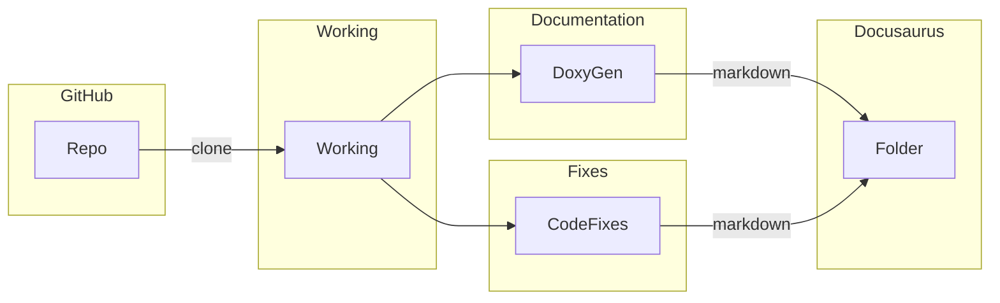

# Document Generation Process #
This process provides information on how generate or regenerate the EOS Portal documents

## Full Release
See [How To Do A Full Release](How-To-Do-A-Full-Release.md) for details on building fresh from an empty directory.

## Generation Steps ##
There are two steps to generating content
* **Pre-Build** - clones the repositories, performs some light manipulation of files, generates javadocs, generates doxygen file
* **Static-Content** - parses the markdown into static content

The static content will need to be supported by an HTTP service. These steps only build out the content. They don't serve the content via HTTP.

### Pre-Build
Copy the markdown files from a repository into a working directory. From there do some processes the markdown doing fixes, and process the code comments into markdown. Finally put the markdown files under the correct location in a Docusaurus instance.

**Fixes**
- convert legacy admonitions to modern format
- remove common unclosed html tags `<br>` or `<hr>`
- move images to static Docusaurus directory and update image paths to match
- change some file names like overview.md to index.md
- suppress some files like a EULA

**Code Documentation**
Runs through headers converts inline code to XML. Then converts XML to markdown. Places markdown inside Docusaurus directory.



### Quick Guide
Brief guide on steps to generating content from markdown to static html/css/js

- install Docusaurus `npm install docusaurus`
- clone repos into local `working` directory
- process files
- copy markdown into `/path/build_root/devdocs/eosdocs`
- run `npm run build` in `/path/build_root/devdocs`
- run `npm run serve` to see local hosted version

**Example:**
Note this assumes all software is installed including Doc6s under *$ARG_BUILD_DIR/devdocs*
```shell
ARG_BUILD_DIR=$HOME/build_root/
git clone https://git.github.com/enf/busio
cd busio
# do process steps here
sed 's/<br>//g' docs/index.html
rm docs/EULA.md
mkdir $ARG_BUILD_DIR/devdocs/eosdocs/busio
# copy markdown
cp -R docs/* $ARG_BUILD_DIR/devdocs/eosdocs/busio
cd $ARG_BUILD_DIR/devdocs
npm run build
npm run serve
```

## Document Server Organization ##
* devdocs - root for Docusaurus project
   * eosdocs/docs - the docs repo
     - markdown
   * eosdocs/cdt - developer tools
     - markdown
     - reference (API documentation from code)
   * eosdocs/eos system contracts
     - markdown
     - reference (API documentation from code)
   * eosdocs/Leap - manuals for core blockchain code
     - markdown
   * eosdocs/* (java, swift, typescript)
     - markdown
     - reference (API documentation from code)
* reference - HTML docs that aren't markdown
   * SDKs (java, swift)
     - (API documentation from code)

## Code Structure

Scripts are under the `scripts` directory. `generate_documents.sh` is called providing the repository and the build directory.
- Docusaurus is installed if it does not already exist
- The repository passed in by name is cloned
- The script enters into the working directory of the cloned content `cd ../working/owner/repo`
- The script sources `install_repo.sh`. It is a naming convention.
- The script calls the fundtion `Install_Repo`. It is a naming convention.

For example
-  Execute `generate_documents -d $HOME/build_root -r eosnetwork/docs`
- Sources `install_docs.sh`
- Function call `Install_docs`, see args below
  -  SCRIPT_DIR=$1
  -  ARG_GIT_REPO=$2
  -  ARG_BUILD_DIR=$3
  -  ARG_BRANCH=$4
  -  ARG_TAG=$5

### Adding a New Repo
If you want to add a new repo named `busio` do the following
1. Create a files `install_busio.sh`
2. Create a function in the file named `Install_Busio`

Inside the fuction `Install_Busio` place the following code

```
mkdir $ARG_BUILD_DIR/devdocs/eosdocs/busio
cp -R docs/* $ARG_BUILD_DIR/devdocs/eosdocs/busio
```
3. Run `generate_documents.sh -d /path/build_root -r enf/busio`

## Static Index Files ##

There is one static index files copied from the `docsgen` repo.

| Code Repository | Pre-Build | Static Content |
| --------------- | --------- | ------- |
| docsgen/web/api-listing.md | /devdocs/eosdocs/api-listing.md | eosdocs/api-listing.html |

## Leap Open APIs ##

These are not markdown files so you will find them under a virtual path `/leap-plugins/`

These are the HTTP APIs documented in YAML files. They are stored in the leap github repository. The YAML files are parsed via javascript code. Specifically [Redocusaurus](https://github.com/rohit-gohri/redocusaurus) is used. The configuration that finds the files and setups the virtual paths is located in the main Docusaurus config.

**Outline of steps**
- find yaml files copy to `build_root/openapi`
- run `npm run build`

## Nodeos Cloes and Kloes ##
The markdown is pulled from github under the `leap` repo. A script is run to add meta-data to the document for better viewing.

## JavaDocs ##
The repo `mandel-java` is cloned and javadocs command is run to generate the docs.

These are not markdown files so you will find them under `reference/javadocs/`

## Swift ##
The repo `mandel-swift` is cloned and the pre-generated swiftdocs and the source code are copied into the specified directory.

These are not markdown files so you will find them under `reference/swiftdocs/`

There is one markdown file, an index of the top level interfaces in Swift. This markdown is copied from github, and it lives under `swift-sdk`

## EOSJS and Typescript ##
The repo `mandel-eosjs` is cloned and typedoc runs to generate the documentation. Typedoc outputs as markdown, and all files are located under `eosdocs/client-side/jsdocs`

## EOS System Contract API Reference ##
The repo `eos-system-contracts` is cloned. The markdown is copied into the `system-contracts` folder and doxygen/doxybook2 is run to generate markdown files which live under `system-contracts/reference`

## Contract Developer Toolkit ##
The repo `cdt` is cloned. The markdown is copied into the `cdt` folder and doxygen/doxybook2 is run to generate markdown files which live under `cdt/reference`

## Setting up New Locales ##
**Docusaurus i18n configs**
If it is your first time run the write-translation plugin to generate the i18n files. Look at *root/i18n* for these files. These file support all of your theme stuff including navbar. Look at *root/i18n/xx* and start translating the expressions. These translations will be picked up by Docusaurus
```
npm run write-translations -- --locale en
```

## Translation ##
The translations come in two form
- **Static Markdown** - You will find these under source control under `i18n` directory as static markdown files
- **React Templates** - The React template will have strings wrapped with `<Translate>` tags.

The full path the to `i18n` folder, is found under the current *docsgen* reposiory.
`docsgen/web/docusarus/i18n`

## Updating Content ##
When changing content under the `docsgen/web` folder make sure to check for localized versions. You will find those versions under `i18n/xx/docusaurus-plugin-content-docs/current`. For example when you change `api-listing.md` you must also change `i18n/zh/docusaurus-plugin-content-docs/current/api-listing.md` and change `i18n/ko/docusaurus-plugin-content-docs/current/api-listing.md`.

## Running local site ##
You can run Docusaurus locally to debug. Cd to `/path/build_root/devdocs` and your port may differ. Note this won't pick up the files under references.
```
cd /path/build_root/devdocs
npm run serve -- --port 39999
```

After making direct changes to files under `/path/build_root/devdocs` you will need to rerun `npm run build` to generate the build directory.

## Navigation Changes

[Updating Navigation](SiteNavigation.md)

## Search
[Site Search](site-search.md)

## Testing
[Testing](Testing.md)
